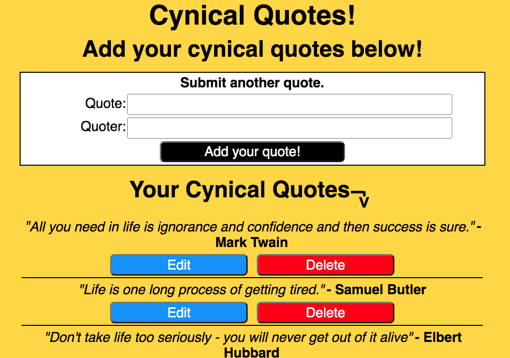
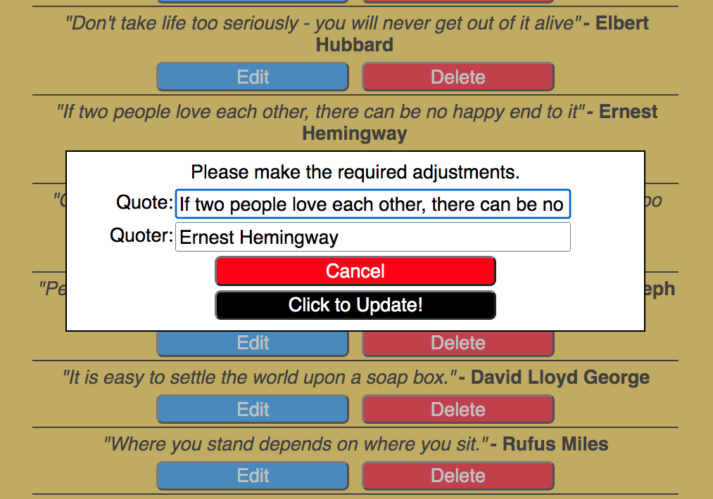
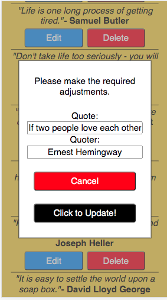

# Cynical Quotes App.

This is a simple CRUD app to contain a user's favourite cynical quotes.

## Built with:
* The MERN stack.
* CSS
---
## Seed data.

Add some example quotes with the below terminal command.

``` 
npm run seeds 
```
---
## App Image: Starter Image.

---
## App Image: In-use Image.

---
## App Image: Responsive Example.

